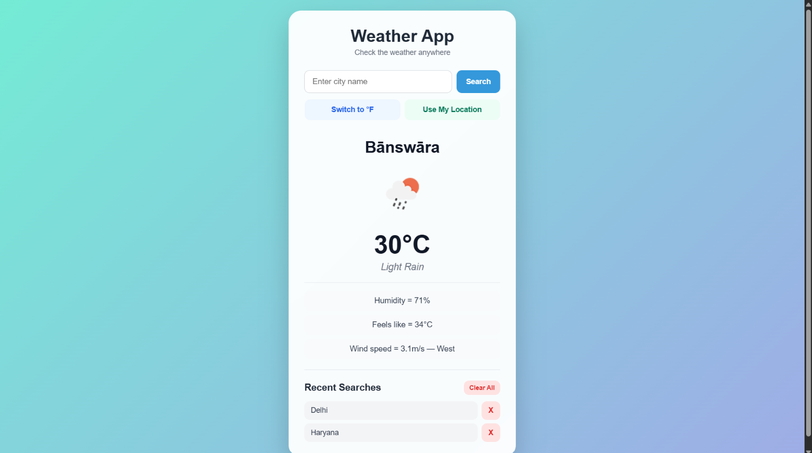
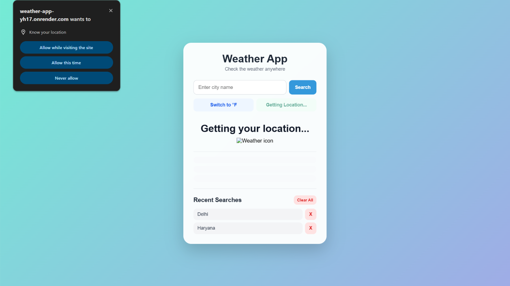
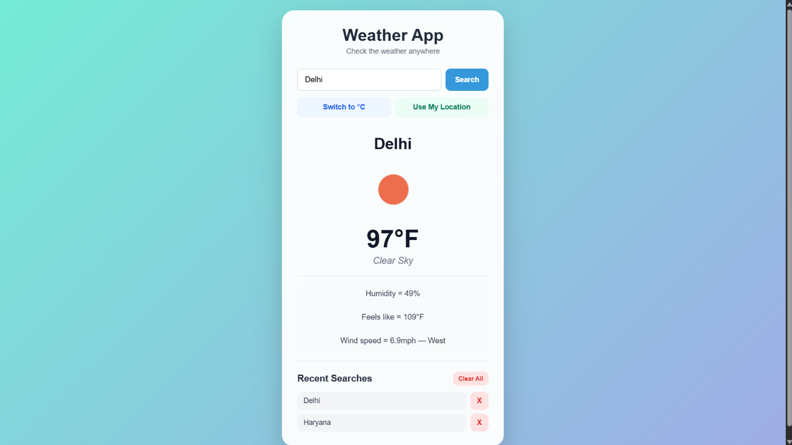

# 🌤️ Weather App

A full-stack weather application that allows users to search for weather information by city or use their current location.

The application uses an Express.js backend to securely communicate with the OpenWeather API, keeping the API key out of the frontend code.

## 🚀 Live Demo

https://weather-app-yh17.onrender.com

## 📸 Screenshots

### City Weather



### Current Location Weather



### Fahrenheit Conversion



## ✨ Features

- 🔍 Search weather by city name
- 📍 Get weather using current location
- 🌡️ Switch between Celsius and Fahrenheit
- 💧 Display humidity
- 🌡️ Display "feels like" temperature
- 💨 Display wind speed and direction
- 🕘 Store recent searches
- 🗑️ Delete individual search history items
- 🧹 Clear all search history
- ⌨️ Search using the Enter key
- 🔒 API key protected using environment variables
- 📱 Responsive user interface

## 🛠️ Technologies Used

### Frontend

- HTML
- CSS
- JavaScript
- DOM Manipulation
- Fetch API
- LocalStorage
- Geolocation API

### Backend

- Node.js
- Express.js
- dotenv

### API

- OpenWeather API

### Deployment

- GitHub
- Render

## 🏗️ How It Works

The application follows this architecture:

Browser
↓
Express.js Backend
↓
OpenWeather API

The frontend sends a request to the Express backend instead of directly exposing the OpenWeather API key.

For example:

```text
/weather?city=Delhi&units=metric
